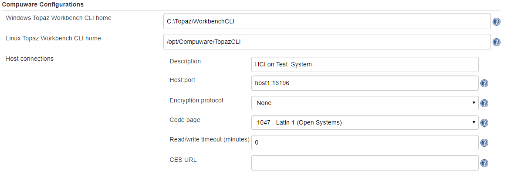

# Compuware Xpediter Code Coverage Plugin

  

## Overview

The Compuware Xpediter Code Coverage plugin allows Jenkins users to extract code coverage results for COBOL source from a Compuware Code Coverage repository. These results can then be viewed in SonarQube.

## Prerequisites

The following are required to use this plugin:
- Jenkins
- Jenkins Credentials Plugin
- Topaz Workbench CLI 18.2.4 or later. Refer to the [Topaz Workbench Install Guide](https://docs.compuware.com/kb/KB2001/PDF/TopazWorkbench_Install.pdf) for instructions.
- Host Communications Interface
- Xpediter/Code Coverage 17.2, PTF PA01563
- Compuware Shared Services 17.2, PTF CXS527A

## Installing in a Jenkins Instance

1. Install the Compuware Xpediter Code Coverage plugin according to the Jenkins instructions for installing plugins. Dependent plugins will automatically be installed.
2. Install the Topaz Workbench CLI on the Jenkins instances that will execute the plugin. The Topaz Workbench CLI is available in the Topaz Workbench installation package. If you do not have the installation package, please visit [support.compuware.com](https://support.compuware.com/). For Topaz Workbench CLI installation instructions, please refer to the [Topaz Workbench Install Guide](https://docs.compuware.com/kb/KB2001/PDF/TopazWorkbench_Install.pdf).

## Configuring for Topaz Workbench CLI & Host Connections

In order to access Code Coverage data you will need to point to an installed Topaz Workbench Command Line Interface (CLI). The Topaz Workbench CLI will work with host connection(s) you also need to configure to download Code Coverage data.

Navigate to Manage Jenkins / Configure System and go to Compuware Configurations section.

- **Windows Topaz Workbench CLI home** : Point to the Windows installation location of the CLI. If necessary, change the default values given to match the correct installation location.

- **Linux Topaz Workbench CLI home** : Point to the Linux installation location of the CLI. If necessary, change the default values given to match the correct installation location.

 The Topaz Workbench CLI must be installed on the machine that is configured to run the job.

**Host connections**

 If no host connection appears in the Host Connections section, click Add Host Connection.

- **Description** : Enter a description of the connection.

- **Host:port** : Enter the z/OS host and port to connect to.

- **Encryption protocol** : Select the desired encryption protocol to be used for this connection. The encryption protocol is used to encrypt data sent to and from the host. The default is \'None\'.

- **Code page** : Select the desired code page to be used for this connection. The code page is used to translate data sent to and from the host. The default is 1047.

- **Read/write timeout (minutes)** : Enter the number of minutes for the plugin to wait for a response from the host before timing out.

- **CES URL** : Optionally, enter a URL for Compuware Enterprise Services (CES). This URL is used by other Compuware plugins that leverage REST APIs hosted by CES, for example Compuware's ISPW.

### Retrieve Xpediter Code Coverage Statistics

This integration allows downloading of Code Coverage data from a repository.

On the **Configuration** page of the job or project, in the **Build** section, from the **Add build step** list, select **Retrieve Xpediter Code Coverage Statistics**.

This build action has following parameters:

- **Host connection** : Select the host connection to be used to connect to the z/OS host.

 Alternatively, to add a connection, click **Manage connections**. The **Host connections** section of the Jenkins configuration page appears so a connection can be added.

- **Login credentials** : Select the stored credentials to use for logging onto the z/OS host.

 Alternatively, click **Add **to add credentials using the [Credentials Plugin](https://plugins.jenkins.io/credentials/). Refer to the Jenkins documentation for the Credentials Plugin.

Do one or both of the following:

- **Path to analysis properties** : Enter the path to an existing ccanalysis.properties file, which is a properties file used to specify the source, repository, system, test, and DDIO override information for the code coverage extraction.

- **Analysis properties** : Enter the parameters for the code coverage extraction, using the following syntax:

     - **cc.sources** : Indicate the relative path to the source directories to be used for the code coverage extraction.
     - **cc.repos** : Indicate the code coverage repository from which to extract code coverage data.
     - **cc.system**: Indicate the system to be included in the scan.
     - **cc.test** : Indicate the test ID to be included in the scan.
     - **cc.ddio.overrides** : Indicate the new location of the program's DDIO file if the file was moved or renamed from what is specified in the repository.

 Parameters entered via the Analysis properties box override corresponding parameters in the ccanalysis.properties file.

If desired, repeat the steps above to add more build steps.

Click Save.

Run the job, which creates a CodeCoverage.XML file containing the code coverage information for the selected programs. This file is located in a Coverage subdirectory in the Jenkins workspace. This file can be input into SonarQube to view the code coverage results.

During the **Execute SonarQube Scanner Step**, add the following property to import the Coverage data into SonarQube. **sonar.coverageReportPaths=Coverage/CodeCoverage.xml**

## Using Pipeline Syntax to Generate Pipeline Script

- Do one of the following:

    - When working with an existing Pipeline job, click the **Pipeline Syntax** link in the left panel. The **Snippet Generator** appears.

    - When configuring a Pipeline job, click the **Pipeline Syntax** link at the bottom of the **Pipeline **configuration section. The **Snippet Generator** appears.

- **Sample Step** : Select **General Build Step** .

- **Build Step** : Select **Retrieve Xpediter Code Coverage Statistics** .

- Complete the displayed fields.

- Click **Generate Pipeline Script**. The Groovy script to invoke the step appears. The script can be added to the Pipeline section when configuring a Pipeline job. A sample script is shown below:

~~~
   stage("Collect Code Coverage")
   {
    node{
        step([$class: 'CodeCoverageBuilder',
        analysisProperties: '''cc.sources=PLAY
        cc.repos=CPWR.CODECOV.REPOSIT
        cc.system=SYSTEM1
        cc.test=TEST1
        cc.ddio.overrides=''',
        analysisPropertiesPath: '',
        connectionId: '63e55263-8d69-4e1c-a91a-baf98ea15745',
        credentialsId: 'eaa1931a-1a63-46f3-ae4a-9729446eb326'])
    }
}
~~~

## Known Limitations
- COBOL is currently the only language supported.
- Source code must be compiled using the Compuware Shared Services(CSS) pre-processor.
     - Other pre-processors can cause changes to the original source file that are undetectable to CSS.
- Nested copybooks within the procedure division are not supported.
- COBOL COPY REPLACING statements in the procedure division may cause source mismatches.

## Product Assistance

Compuware provides assistance for customers with its documentation, the Compuware Support Center web site, and telephone customer support.

### Compuware Support Center

You can access online information for Compuware products via our Support Center site at [https://support.compuware.com](https://support.compuware.com/). Support Center provides access to critical information about your Compuware products. You can review frequently asked questions, read or download documentation, access product fixes, or e-mail your questions or comments. The first time you access Support Center, you must register and obtain a password. Registration is free.

### Contacting Customer Support

At Compuware, we strive to make our products and documentation the best in the industry. Feedback from our customers helps us maintain our quality standards. If you need support services, please obtain the following information before calling Compuware\'s 24-hour telephone support:

- The Jenkins job console output that contains any error messages or pertinent information.

- The name, release number, and build number of your product. This information is displayed in the Jenkins / Plugin Manager and go to the Installed tab. Apply filter: Compuware in order to display all of the installed Compuware plugins.

- Job information, whether the job uses Pipeline script or Freestyle project.

- Environment information, such as the operating system and release on which the Topaz CLI is installed.

You can contact Compuware in one of the following ways:

#### Phone

- USA and Canada: 1-800-538-7822 or 1-313-227-5444.

- All other countries: Contact your local Compuware office. Contact information is available at [https://support.compuware.com](https://support.compuware.com/).

#### Web

You can report issues via Compuware Support Center: [https://support.compuware.com](https://support.compuware.com/).

Note: Please report all high-priority issues by phone.

### Corporate Web Site

To access Compuware\'s site on the Web, go to [https://www.compuware.com](https://www.compuware.com/). The Compuware site provides a variety of product and support information.

## Change Log
See [Change Log](https://github.com/jenkinsci/compuware-xpediter-code-coverage-plugin/blob/master/CHANGELOG.md)

